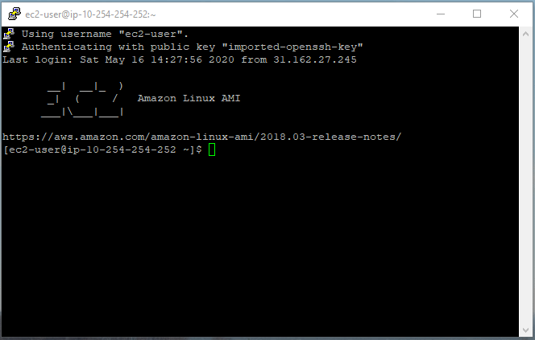

# Portal Database
Database schema and table data<br><br>

Database diagram can be found [here](https://dbdiagram.io/d/5ebafd9239d18f5553ff19bc)<br><br>

Get latest schema creation script from dbdiagram:<br>
<p align="center">
  
</p>

## Solution contents
Project contains 3 scripts:
1. 00_HEAD.sql - previous database cleanup. Drops all tables and views in cascade
2. 01_BODY.sql - application of current schema. Script is similar to dbdiagram export
3. 02_TAIL.sql - population of some tables with data (TypeCode)

## Combine all three scripts into one and apply at the database

## AWS database connection (putty)

1. Aquire bastion private key (.pem)
2. Use puttygen.exe to convert private key to .ppk format (do not set any passwords)
3. Save .ppk file on your computer
4. Use following command to enable port forwarding:
```sh
putty.exe -v -ssh -2 -C -L 5432:recona-dev.cluster-cskeilxqtugz.eu-central-1.rds.amazonaws.com:5432 ec2-user@ec2-3-127-205-242.eu-central-1.compute.amazonaws.com -i *PATH_TO_PPK_FILE*/bastion.ppk
```
If connection was successful you would see something like this:<br>
<p align="center">
  
</p>

5. Install [pgAdmin](https://www.pgadmin.org/)
6. Turn on pgAdmin
7. Setup connection as shown on the image
<p align="center">
  
</p>

8. Enter Master username and password
9. Connect to the database
10. Access ReconAI database
<p align="center">
  
</p>

11. Press 'Query Tool' button to create a query (apply latest version of the database)

## AWS database connection (ssh)

Steps similar to putty, but insted key converstion use following command:
```sh
ssh -i “*PATH_TO_BASTION_PEM*/bastion.pem” -L5432:recona-dev.cluster-cskeilxqtugz.eu-central-1.rds.amazonaws.com:5432 ec2-user@ec2-3-127-205-242.eu-central-1.compute.amazonaws.com
```
